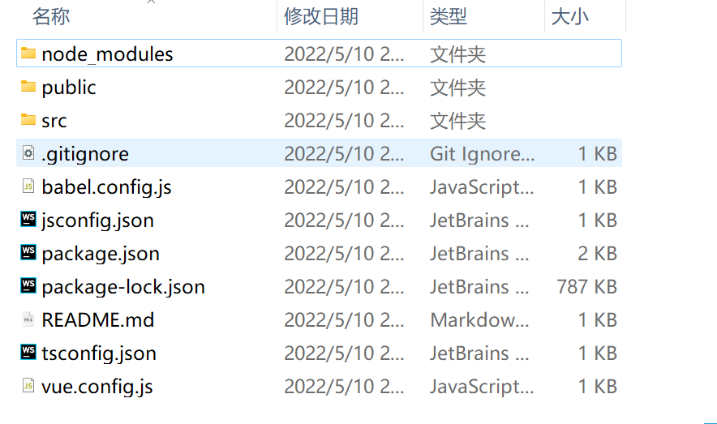

# 第 2 章 快速开启第一个 Vue,js 应用

## 2.3 探索Vue.js应用

### 2.3.1 整体项目结构

- 项目分为 4 部分
  - 项目根目录文件
  - node_modules 目录
  - public 目录
  - src 目录

### 2.3.2 项目根目录文件

- 项目根目录文件包含以下几个文件

  - .gitignore:
    - 用于配置哪些文件不受git管理
  - babel.config.js:
    - Babel中的配置文件
    - Babel是一款JavaScript编译器

  - package.json、package-lock.json：
    - NPM包管理器的配置文件
  - README.md:
    - 项目的说明文件

### 2.3.3 node_modules目录

- 目录用来存放利用包管理工具安装的包的文件夹

### 2.3.4 public 目录

- public目录在以下情况中使用
  - 需要在构建输出中指定一个文件的名字
  - 有上千张图片，需要动态引用它们的路径
  - 有些库可能和webpack不兼容，将这些库存储在public目录下，然后将其用一个独立的\<script>标签引入

### 2.3.5 src目录

- src目录是存储项目代码的目录
  - asserts：用于放置静态文件
  - components：用于放置Vue.js公共组件
  - App.vue:页面入口文件也是根组件，
  - main.js:程序入口文件
    - 主要作用是初始化Vue.js应用实例并使用需要的插件

#### 1. main.js

```
import Vue from 'vue'
import App from './App.vue'

Vue.config.productionTip = false

new Vue({
  render: h => h(App),
}).$mount('#app')

```

- 初始化了Vue.js的应用实例
  - 该应用实例来自App.vue根组件

#### 2. App.vue

- App.vue是根组件，整个应用只有一个

```
<template>
  <div id="app">
    
    <HelloWorld msg="Welcome to Your Vue.js App"/>
  </div>
</template>

<script>
import HelloWorld from './components/HelloWorld.vue'

export default {
  name: 'App',
  components: {
    HelloWorld
  }
}
</script>

<style>
#app {
  font-family: Avenir, Helvetica, Arial, sans-serif;
  -webkit-font-smoothing: antialiased;
  -moz-osx-font-smoothing: grayscale;
  text-align: center;
  color: #2c3e50;
  margin-top: 60px;
}
</style>

```

- 上述代码由3部分组成，
  - \<template>
  - \<script>
  - \<style>
- 这3部分可以简单理解为是一个网页的3个核心部分
  - HTML
  - JavaScript
  - CSS
- \<template>又引用了一个HelloWorld.vue子组件
  - 该HelloWorld.vue子组件是通过\<script>引入的

#### 3. HelloWorld.vue

- HelloWorld.vue子组件是整个应用的核心

```
<template>
  <div class="hello">
    <h1>{{ msg }}</h1>
    <p>
      For a guide and recipes on how to configure / customize this project,<br>
      check out the
      <a href="https://cli.vuejs.org" target="_blank" rel="noopener">vue-cli documentation</a>.
    </p>
    <h3>Installed CLI Plugins</h3>
    <ul>
      <li><a href="https://github.com/vuejs/vue-cli/tree/dev/packages/%40vue/cli-plugin-babel" target="_blank" rel="noopener">babel</a></li>
      <li><a href="https://github.com/vuejs/vue-cli/tree/dev/packages/%40vue/cli-plugin-eslint" target="_blank" rel="noopener">eslint</a></li>
    </ul>
    <h3>Essential Links</h3>
    <ul>
      <li><a href="https://vuejs.org" target="_blank" rel="noopener">Core Docs</a></li>
      <li><a href="https://forum.vuejs.org" target="_blank" rel="noopener">Forum</a></li>
      <li><a href="https://chat.vuejs.org" target="_blank" rel="noopener">Community Chat</a></li>
      <li><a href="https://twitter.com/vuejs" target="_blank" rel="noopener">Twitter</a></li>
      <li><a href="https://news.vuejs.org" target="_blank" rel="noopener">News</a></li>
    </ul>
    <h3>Ecosystem</h3>
    <ul>
      <li><a href="https://router.vuejs.org" target="_blank" rel="noopener">vue-router</a></li>
      <li><a href="https://vuex.vuejs.org" target="_blank" rel="noopener">vuex</a></li>
      <li><a href="https://github.com/vuejs/vue-devtools#vue-devtools" target="_blank" rel="noopener">vue-devtools</a></li>
      <li><a href="https://vue-loader.vuejs.org" target="_blank" rel="noopener">vue-loader</a></li>
      <li><a href="https://github.com/vuejs/awesome-vue" target="_blank" rel="noopener">awesome-vue</a></li>
    </ul>
  </div>
</template>

<script>
export default {
  name: 'HelloWorld',
  props: {
    msg: String
  }
}
</script>

<!-- Add "scoped" attribute to limit CSS to this component only -->
<style scoped>
h3 {
  margin: 40px 0 0;
}
ul {
  list-style-type: none;
  padding: 0;
}
li {
  display: inline-block;
  margin: 0 10px;
}
a {
  color: #42b983;
}
</style>

```

- HelloWorld.vue子组件的结构与App.vue根组件的结构相同，
  - 也包含了3部分

- \<script>导出了一个msg的String类型的属性变量
  - 该变量在\<template>的\<h1>{{msg}}\</h1>进行了绑定
- 在界面渲染完成时，界面中的{{msg}}位置的内容
  - 会被该属性变量的值所替换

```
<template>
  <div id="app">
    
    <HelloWorld msg="Welcome to Your Vue.js App"/>
  </div>
</template>
```

- HelloWorld.vue子组件的msg属性是
  - "Welcome to Your Vue.js App"

- 意味着HelloWorld.vue子组件可以接收App.vue根组件的传值

### 2.4.3 TypeScript应用的差异

- 添加了TypeScript的配置文件tsconfig.json
- 在package.json和package-lock.json中添加了对TypeScript等依赖的描述
- main.js被改为了main.ts
- 所有在Vue.js组件中使用JavaScript的地方都改为TypeScript



- TypeScript版本的App.vue文件代码如下

```
<template>
  
  <HelloWorld msg="Welcome to Your Vue.js + TypeScript App"/>
</template>

<script lang="ts">
import { Options, Vue } from 'vue-class-component';
import HelloWorld from './components/HelloWorld.vue';

@Options({
  components: {
    HelloWorld,
  },
})
export default class App extends Vue {}
</script>

<style>
#app {
  font-family: Avenir, Helvetica, Arial, sans-serif;
  -webkit-font-smoothing: antialiased;
  -moz-osx-font-smoothing: grayscale;
  text-align: center;
  color: #2c3e50;
  margin-top: 60px;
}
</style>

```

