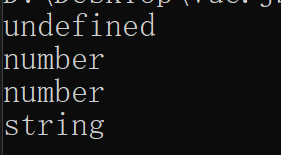

# 第 3 章 TypeScript基础

## 3.1 TypeScript概述

### 3.1.1 TypeScript 与 JavaScript、ECMAScript的关系

- TypeScript充分利用了JavaScript原有的对象模型
  - 并在此基础上进行了扩充
- 任何合法的JavaScript都可以用在TypeScript中
- TypeScript是以JavaScript为目标语言的一种编译语言，
  - 并且提供了向原生JavaScript转换的编译器
- 如果想要运行TypeScript代码
  - 则先通过编译器将TypeScript代码编译成JavaScript
  - 然后才被浏览器运行
- ECMAScript是JavaScript的国际标准
  - JavaScript是ECMAScript的实现

### 3.1.2 TypeScript与Vue.js的关系

- 早期的Vue.js版本都是采用JavaScript作为开发语言的
- JavaScript代码缺乏强类型、模块化、可测试等特性
  - 在企业大规模开发中很难管理它
- 自Vue.js3版本开始，支持使用TypeScript来开发Vue.js应用

### 3.1.3 使用TypeScript的优势

- TypeScript充分利用了JavaScript原有的对象模型
  - 添加了类型检查机制、模块支持、API导出的能力
- TypeScript使得代码组织和服用变得更有序
  - 又使得开发大型Web应用有了一套标准方法
- TypeScript具有静态类型检查、代码重构、测试和语言服务
  - 有利于大型团队人员协作编写代码

### 3.1.4 安装TypeScript

- 想要使用TypeScript，需要在本地安装TypeScript

```
npm install -g typescript
```

### 3.1.5 TypeScript代码的编译及运行

- 浏览器不能直接运行TypeScript代码
- 所有的TypeScript代码必须
  - 经过TypeScript编译器编译成JavaScript文件，
  - 才能被浏览器运行

#### 1. 编写TypeScript代码

- 编写一段简单的TypeScript代码
  - 并将其保存在hello-typescript.ts文件中

```
var hello = 'Hello World';
console.log('hello');
```

#### 2. 编译TypeScript代码

- 通过TypeScript编译器对hello-typescript.ts文件进行编译

- 执行以下命令进行编译

```
tsc hello-typescript.ts
```

- 编译后，在与hello-typescript文件相同的目录下
  - 可以看到一个自动生成的hello-typescript.js文件
- hello-typescript.js文件内容如下：

```
var hello = "Hello World";
console.log("hello");

```

- 在这个实例中，TypeScript使用了与JavaScript一致的语法

#### 3.运行JavaScript文件

- 在Node.js中运行该JavaScript文件，执行以下命令：

```
node hello-typescript.js
```

```
hello
```

## 3.2 变量与常量

### 3.2.1 var、let、const三者的作用域

- const是对let的一个增强
  - 不允许对一个变量再次赋值
  - 一般用于常量
- 三者的作用域如下：
  - 使用var声明的变量，作用域在该语句所在的函数内
    - 存在变量提升
  - 使用let声明的变量，作用域在该语句所在的代码块内
    - 不存在变量提升
  - 使用const一般声明的变量
    - 不能再后面出现的代码中修改该常量的值

### 3.2.2 变量与常量的区别

- const用于声明常量
- 变量在被赋值之后可以被修改
  - 而常量则不能被修改

### 3.2.3 变量提升

- var存在变量提升
  - let、const不存在变量提升
- 为了防止变量误用
  - 尽量采用let和const代替var

## 3.3 TypeScript数据类型

- TypeScript具有静态类型检查功能，
  - 可以在编译期间快速定位类型错误的问题

### 3.3.1 基本类型

- TypeScript的基本类型包括Number、Boolean、String、Symbol、Void、Null、Undefined以及用户定义的枚举类型

#### 1. Number

- Number类型对应JavaScript中的Number类型
  - 用来表示双精度64位格式IEEE 754浮点值
- 关键字“number”表示Number类型

```
var x: number; // 指定类型
var y = 0; // 等同于 y: number = 0
var z = 123.456; // 等同于 z:number = 123.456
var s = z.toFixed(2); // 使用了Number接口属性
console.log(typeof x); // undefined
console.log(typeof y); // number
console.log(typeof z); // number
console.log(typeof s); // string

```

- 其中，变量说明如下：
  - 变量x指定了Number类型
  - 变量y和z没有指定类型，
    - TypeScript根据所赋的值来推导出类型
  - 变量s的类型是通过Number.toFixed()方法来返回的
- 通过typeof()函数，能够在控制台上看到各个变量的类型



- 为什么变量x声明为Number类型
  - 但实际的类型是Undefined
- TypeScript规范指出，
  - 只要是未被赋值的变量都是Undefined类型

#### 2. Boolean

- Boolean类型对应JavaScript中的Boolean类型
  - 用来表示true或false的逻辑值
- 关键字boolean表示Boolean类型

```
var b: boolean; //指定类型
var yes = true; //等同于 yes:boolean = true
var no = false; //等同于 no：boolean = false

console.log("b type is:" + typeof b); // undefined
console.log("b type is:" + typeof yes); // boolean
console.log("b type is:" + typeof no); // boolean

b = false; //赋值
console.log("b type is:" + typeof b); // boolean

```

#### 3. String

- String类型用来存储为Unicode UTF-16的字符序列
- 关键字string表示String类型

```
var s: string;
var empty = "";
var abc = "abc";
var c = abc.charAt(2);

console.log(typeof s); //undefined
console.log(typeof empty); //string
console.log(typeof abc); //string
console.log(typeof c); //string

s = "false";
console.log(typeof s); //string

```

#### 4. Symbol

- Symbol类型对应JavaScript中的Symbol类型
  - 用来表示对象属性的键
  - 这些键都是唯一的
- 关键字symbol表示Symbol类型

#### 5. Void

- 如果函数不需要返回值，则使用Void类型
- 关键字void表示Void类型，表示默认值
- Void类型的值是null和undefined
- Void类型是任意类型的子类型
  - 是Null和Undefined类型的超类型

#### 6. Null

- Null类型对应JavaScript中的Null类型
- null表示引用Null类型的值，无法直接引用Null类型本身
- Null类型是除Undefined类型外的所有类型的子类型
  - null可以被认为是所有基本类型、对象类型、联合类型、交集类型和类型参数的有效值
    - 甚至包括Number类型和Boolean类型

```
var n: number = null; //基本类型可以被赋值为null
var x = null; //等同于x: any = null
var e = Null; //错误，不能直接引用Null类型
```

#### 7. Undefined

- undefined表示未初始化变量的值
  - 并且是Undefined类型的唯一值
- 无法直接引用Undefined类型本身
- Undefined类型是所有类型的子类型
  - undefined可以被认为是所有类型的有效值

```
var n: number; //等同于n: number = undefined
var x = undefined; //等同于x: any = undefined
var e: Undefined; //错误，不能直接引用undefined类型
```

#### 8.枚举

- 枚举类型是不同用户定义的Number类型的子类型
- 枚举类型使用枚举声明及类型引用声明
- 枚举类型可以分配给Number类型
  - 反之亦然
- 不同的枚举类型不能彼此分配

```
enum Direction {
    Up = 1,
    Down = 2,
    Left = 3,
    Right = 4
}
```

### 3.3.2 对象类型

- 对象类型由属性、调用签名、构造签名、索引签名等成员组成
- 类和接口类型、数组类型、元组类型、函数类型、构造函数类型都是对象类型
- TypeScript可以创建对象类型

### 3.3.3 任意类型

- 有时需要描述“在编写应用时还不知道”的变量类型
  - 使用任意类型来标记这种类型

#### 1. 用any表示任意类型

```
let notSure: any = 4;
notSure = "也许是字符串";
notSure = false; // 现在是Boolean类型
```

- 任意类型允许在编译期间选择加入和退出类型检查
- 对象类型的变量只允许被分配任意值
  - 而不能在它们上面调用任意方法
  - 这是与任意类型最大的差异

#### 2. 用Object表示任意类型

```
let notSure: any = 4;
notSure.ifItExists(); //ifItExists()方法可能在运行时存在
notSure.toFixed(); //toFixed()方法存在

let prettySure: Object = 4;
prettySure.toFixed(); //错误，在Object类型中不存在toFixed()方法
```

- notSure变量所使用的方法在编译期间不会有任何问题
- prettySure变量会报错，因为toFixed()不是Object类型的方法

#### 3. 演示任意类型的使用

- 有一个数组，该数组中有不用类型的元素

```
let a:any[] = [1, true, 'free'];
```

- 可以对该数组中的元素执行替换或追加操作
  - 替换的元素可以与被替换的元素类型不一致

- 将数组中的true、‘free’元素分别替换为2、3并追加元素4

```
a[1] = 2;
a[2] = 3;
a[3] = 4;
```

### 3.3.4 联合类型

- 联合类型表示可以将变量设置为多种类型中的一种
- 联合类型“A|B”的值是类型A或类型B的值

```
var x: string | number;
var test: boolean;
x = "hello"; //正确
x = 42; //正确
x = true; // 错误，未关联true
```

### 3.3.5 交集类型

- 交集类型是把多种类型叠加到一起形成的一种新类型
  - 新类型包含了被叠加类型的特性

```
interface A { a: number }
interface B { b: number }

var ab: A & B = { a: 1, b: 1};
var a: A = ab; // A可归属于 A & B
var b: B = ab; // B可归属于 A & B

interface X { p: A }
interface Y { p: B }

var xy = X & Y = { p: ab } // X & Y有一个A&B类型的属性

type F1 = {a: string, b: string} => void;
type F2 = {a: number, b: number} => void;
var f: F1&F2 = (a:string | number, b: string | number) => { };

f("hello", "world"); //正确
f(1, 2); //正确
f(1, "test") //错误
```

## 3.4 强大的面向对象体系

### 3.4.1 类

#### 1. 类的定义与使用

- 使用关键字class来定义类

```
class Greeter {
	greeting: string;
	//构造函数
	constructor(message: string) {
		this.greeting = message;
	}
	//欢迎方法
	greet() {
		return "Hello, " + this.greeting;
	}
}

//初始化
let greeter = new Greeter("Way Lau");
console.log(greeter.greet());
```

- 该类具有greeting属性、constructor()构造函数、greet()方法
- 在引用任何一个类成员时都使用了this
  - 它表示访问的是类的成员
- 通过new关键字能够初始化Greeter类的一个实例
  - 并使用实例的greet()方法

#### 2. 继承

- 类可以被继承

#### 3. public、private与protected修饰符

- 3种修饰符
  - public修饰符：
    - 外部可以自由访问该修饰符所标记的成员
    - 成员默认是public类型
  - private修饰符：
    - 不能在声明它的类的外部访问
  - protected修饰符：
    - protected成员在派生类中仍然可以被访问

#### 4. 静态属性

- 也可以创建类的静态成员，这些属性属于类本身
  - 而不是类的实例

```
class Grid {
	static origin = {x: 0, y: 0};
}
```

- 使用“Grid.”来访问静态属性

#### 5. 抽象类

- 抽象类是其它派生类的基类，它们一般不会直接被实例化
- 抽象类可以包含成员的实现细节

- abstract关键字用于定义抽象类
  - 并在抽象类内部定义抽象方法

```
abstract class AbstractAnimal {
	abstrcat makeSound(): void;
	move(): void {
		console.log("roaming the earch");
	}
}
```

- 抽象类中的抽象方法不包含具体实现
  - 并且必须在派生类中实现
- 抽象方法必须包含abstract关键字
  - 并且可以包含访问修饰符

```
abstract class Department {
	constructor(public name: string) {}
	printName():void {}
	abstract printMeeting():void;//必须在派生类中实现
}

class AccountingDepartment extends Department {
	constructor() {
		super('Accountinf and Auditing');
	}
	printMeeting():void {}
	generateReports():void {}
}
```

### 3.4.2 接口

- 接口用于约定代码或第三方代码是如何被执行、调用的
- 接口也可以通过继承来实现扩展

### 3.4.3 实战演示接口的使用

#### 1. 接口定义

- 可以使用interface关键字来定义接口

```
interface ClockInterface {
	currentTime: Date;
}
```

#### 2. 接口实现

- 使用implements关键字来实现接口

```
class Clock implements ClockInterface {
	currentTime: Date;
	constructor(h: number, m: number) {}
}
```

#### 3. 接口继承

```
interface Shape {
	color: string;
}

interface Square extends Shape {
	sideLength: number;
}

let square = <Square>{}
square.color = "blue";
square.sideLength = 10;
```

### 3.4.4 泛型

- 组件不仅支持当前的数据类型，也能支持未来的数据类型
- 使用泛型就能创建可重用的组件

### 3.4.5 实战演示泛型的使用

- identity()函数会返回任何传入它的值

#### 1. 不适用泛型的情况

```
function identity(arg: number): number {
	return arg;
}
```

- 或者使用any类型来定义identity()函数

```
function identity(arg: any): any {
	return arg;
}
```

- 虽然使用any类型后identity()函数能接收任何类型的arg参数
  - 但是无法保证传入的参数类型与返回值的类型相同

#### 2. 使用泛型的情况

```
function identity<T>(arg: T): T {
	return arg;
}
```

- 给identity添加一个类型变量T
- T用于捕获用户传入的类型（如Number）
  - 可以使用T作为返回值的类型
- 通过两种方法使用它
- 第一种是传入所有的参数，包括类型参数

```
let ouput = identity<string>("I am a String");
```

- 第二种是利用类型推导，可以省略显示传入类型
  - 编译器会根据传入的参数自动确定T的类型
  - （这种方法更普遍）

```
let output = identity("I am a String");
```

### 3.4.6 枚举

- 枚举类型通过enum关键字来定义

```
enum Direction {
	Up = 1,
	Down = 2,
	Left = 3,
	Right = 4
}
```

- 一个枚举类型可以包含0个或多个枚举成员
- 枚举成员具有一个数值
  - 它可以是常量或通过计算得出的值
- 当满足以下任何一个条件时，枚举成员被当作常量
  - 不具有初始化函数，并且之前的枚举成员是常量
    - 当前枚举成员的值为上个枚举成员的值加1
    - 第一个枚举成员初始值为0
  - 枚举成员使用常量枚举表达式初始化
    - 常量枚举表达式时TypeScript表达式的子集
      - 它可以在编译阶段求值
- 下面实例展示枚举成员被当作通过计算得出的值

```
enum FileAccess {
	//常量成员
	None,
	Read = 1 << 1,
	Write = 1 << 2,
	ReadWrite = Read | Write,
	//计算出来的成员
	G = "123".length
}
```

## 3.5 TypeScript的命名空间

- 命名空间是一种在命名容器的层次结构中
  - 组织代码和声明的机制
- 命名空间具有命名成员
  - 每个成员表示值、类型、命名空间或它们的组合
  - 并且这些成员可以是本地成员或导出成员
- 命名空间的主体对应执行一次的函数
  - 从而提供用于保持局部状态并确保隔离机制
- 命名空间可以被认为是
  - “立即调用的函数表达式（IIFE）模式的形式化”
- 命名空间可以简单理解为Java的包
- 在TypeScript中，使用命名空间namespace关键字

### 3.5.1 声明命名空间

- 命名空间可以是实例化的，也可以是非实例化的
  - 非实例化的命名空间仅包含接口类型、类型别名
    - 及其它非实例化命名空间的命名空间
  - 实例化的命名空间是不符合此定义的命名空间

- 实例化的命名空间是为其创建命名空间实例的命名空间
  - 非实例化的命名空间是不为其生成代码的命名空间
- 当命名空间标识符被引用为NameSpaceName时，
  - 它表示命名空间和类型名称的容器
- 当命名空间标识符被引用为PrimaryExpression时
  - 它表示命名空间的单实例

### 3.5.2 实战声明命名空间

```
namespace M {
	export interface P { x: number; y: number}
	export var a = 1;
}
var p: M.P; // M作为NameSpaceName
var m = M; // M作为PrimaryExpression
var x1 = M.a; //M作为PrimaryExpression
var x2 = m.a; //等同于 M.a
var q: m.p; // 错误
```

- 当M作为PrimaryExpression时
  - 表示M具有单个类型成员a的对象实例
- 当M作为NameSpaceName时
  - 表示M具有单个类型成员P的容器
- m.P是错误的，因为m是一个无法在类型名称中引用的变量
- 如果M声明排除了导出的变量a
  - 则M是一个非实例化的命名空间
  - 将M作为PrimaryExpression引用是错误的

```
namespace A.B.C {
	export var x = 1;
}
```

- 等同于：

```
namespace A {
	export namespace B {
		export namespace C {
			export var x = 1;
		}
	}
}
```

### 3.5.3 命名空间体

- 命名空间体对应执行一次已经初始化命名空间实例的函数

### 3.5.4 导入别名声明

- 导入别名声明用于为其他命名空间中的实体创建本地别名

- 由单个标识符组成的EntityName被解析为NameSpaceName
  - 因此需要引用命名空间
- 生成本地别名引用给定的命名空间
  - 并且本身被归类为命名空间
- 由多个标识符组成的EntityName被解析为NameSpaceName
  - 后跟一个标识符
  - 该标识符指定给命名空间中的导出实体
- 生成的本地别名具有引用实体的所有含义
  - 就好像导入的实体是使用本地别名在本地声明的一样

### 3.5.5 实战导入别名声明

```
namespace A {
	export interface X { s: string }
	export var X: X;
}

namespace B {
	interface A { n: number }
	import Y = A; // Y仅作为命名空间A的别名
	import Z = A.X; // Z作为A.X的别名
	var v: Z = Z;
}
```

- 在B中，Y仅是命名空间A的别名
  - 而不是本地接口A的别名
- Z是A.X的别名 
- 如果EntityName的NamespaceName部分引用实例化的命名空间
  - 则在评估为表达式时，
    - NameSpaceName需要引用命名空间实例

```
namespace AA {
	export interface XX { s: string }
}
namespace BB {
	var AA = 1;
	import YY = AA;
}
```

- YY是非实例化命名空间AA的本地别名
- 如果更改AA的声明，使得AA成为实例化的命名空间
  - 则BB中的import YY = AA；是一个错误语句
    - 因为AA不是命名空间AA的命名空间实例
- 当import语句包含export修饰符时
  - 将导出本地别名的所有含义

### 3.5.6 导出声明

- 导出声明用于从外部访问命名空间成员
- 任何声明都能够通过添加export关键字来导出
- 在命名空间的导出声明中
  - 空间的成员构成了命名空间的导出成员集
- 命名空间的实例类型是一种对象类型
  - 导出成员集中的每个成员都有一个属性，
    - 表示一个值

- 导出的成员依赖于一组命名类型
  - 这些命名类型只是与导出的成员一样可以被访问

```
interface A { x: string }

namespace M {
	export interface B { x: A }
	export interface C { x: B }
	export function foo(c: C) {}
}
```

### 3.5.7 合并声明

- 具有相对与公共根的相同限定名称的命名空间可以被合并为单个命名空间
- 如果需要合并命名空间，则需要保证在每个命名空间中声明的
  - 导出接口的类型定义本身已被合并
  - 形成一个内部具有合并接口定义的命名空间
- 如果需要合并命名空间值，则可以通过获取现有命名空间
  - 并将第2个命名空间的导出成员添加到第1个命名空间

### 3.5.8 实战合并声明

```
namespace Animals {
	export class Zebra {}
}

namespace Animals {
	export interface Legged { numberOfLegs: number; }
	export class Dog { }
}
```

- 等同于合并后的声明：

```
namespace Animals {
	export interface Legged { numberOfLegs; number}
	export class Zebra {}
	export class Dog {}
}
```

